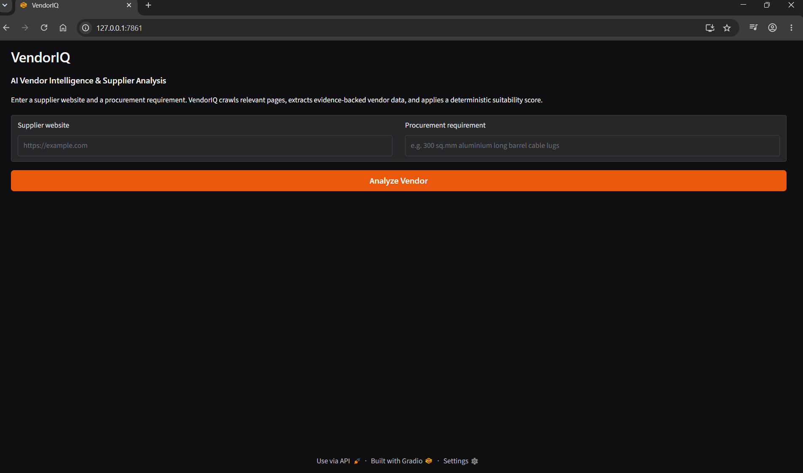
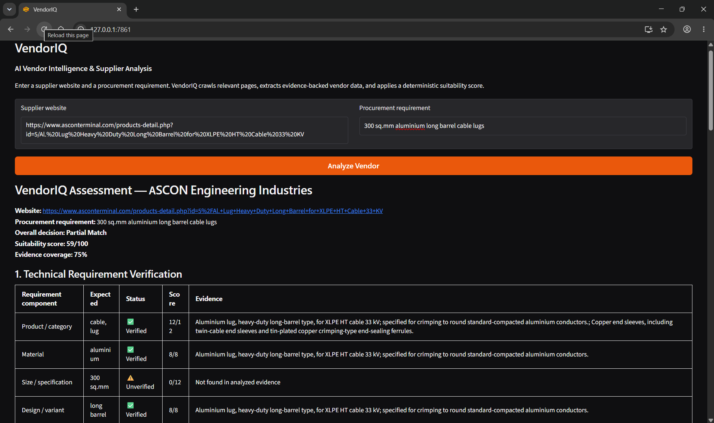

# VendorIQ

### AI Vendor Intelligence & Supplier Analysis Platform

VendorIQ is an LLM-powered procurement intelligence application that analyzes supplier websites, extracts evidence-backed vendor information, verifies procurement requirements at attribute level, and produces an explainable supplier suitability assessment.

The system combines **LLM-based unstructured data extraction** with **deterministic Python scoring**, so the model interprets supplier content while business decisions remain transparent and reproducible.

---

## Demo

### VendorIQ Interface



### Sample Supplier Assessment



---

## Problem Statement

Supplier qualification often requires procurement teams to manually review:

- company websites
- product pages
- certifications
- industry coverage
- technical specifications
- contact information
- manufacturing capabilities

This process is time-consuming and can lead to inconsistent supplier assessments.

VendorIQ automates the research stage while preserving traceability to the original supplier evidence.

---

## Key Features

### Evidence-Aware Website Crawling

VendorIQ crawls the supplied vendor website and prioritizes different types of relevant pages, including:

- product pages
- company/about pages
- certifications and quality pages
- industries/applications
- manufacturing/capability pages
- contact/location pages

Product-specific query parameters are preserved so important product URLs are not accidentally reduced to generic pages.

### Structured LLM Extraction

Supplier website content is analyzed using an LLM and converted into structured data validated with **Pydantic**.

Extracted information includes:

- products
- technical/manufacturing capabilities
- company claims
- certifications and approvals
- industries served
- locations
- contact details
- missing information
- technical disclaimers
- explicit risk indicators

### Requirement-Level Verification

A procurement requirement such as:

```text
300 sq.mm aluminium long barrel cable lugs